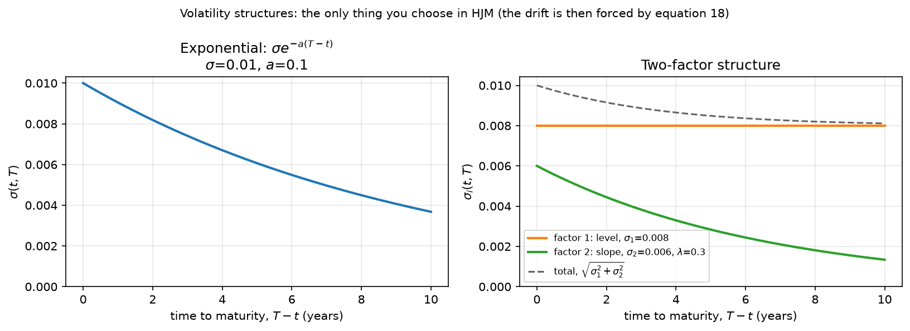
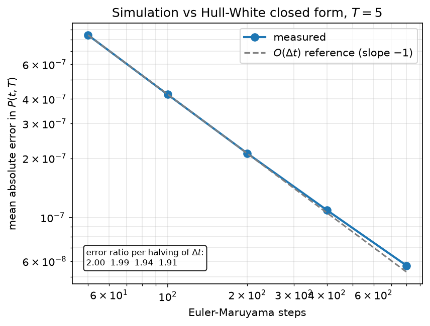
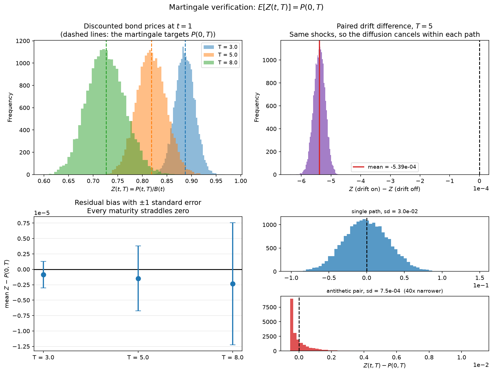
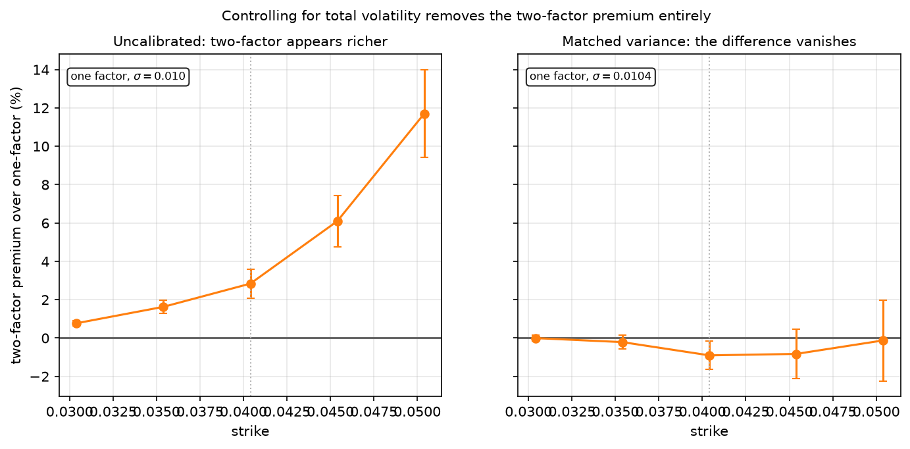

# HJM Forward Rate Model

A replication of Heath, Jarrow & Morton (1992), *"Bond Pricing and the Term
Structure of Interest Rates: A New Methodology for Contingent Claims
Valuation,"* Econometrica 60(1), 77–105.

The no-arbitrage drift restriction is derived from first principles, implemented
as a Monte Carlo simulation of the full forward rate curve, validated against the
Hull-White closed-form special case, and then used to establish where a
multi-factor volatility structure does and does not change prices.

---

## The result HJM establishes

Specify how volatile forward rates are, and no-arbitrage **forces** their drift:

```
alpha(t,T) = sigma(t,T) * integral_t^T sigma(t,v) dv   -   sigma(t,T) * phi(t)
```

You do not get to choose the drift independently. Under the risk-neutral measure
the market price of risk `phi(t)` cancels out entirely, leaving contingent claim
prices determined by the volatility structure alone — a quantity that can be
calibrated from market data, unlike the market price of risk.

The framework also takes today's observed forward curve as a direct input rather
than deriving it, which avoids the "inversion of the term structure" problem the
paper identifies in equilibrium models such as Cox-Ingersoll-Ross (Section 8).



*The volatility structure is the only free choice. The exponential form on the
left is the one that reduces HJM to Hull-White; the two-factor form on the right
separates a level factor from a slope factor that decays with maturity.*

---

## Headline finding

A second volatility factor is worth nothing on a caplet and a great deal on a
spread option, and the difference is structural rather than a matter of
calibration.

| instrument | depends on | two-factor vs matched one-factor |
|---|---|---|
| caplet | one forward rate's marginal distribution | no detectable difference (\|t\| < 1.25) |
| spread option | the joint distribution of two forward rates | 38–107% higher, t = 41 to 87 |

The caplet result is a **null**, and deliberately so: the raw comparison showed a
two-factor premium of up to 10.7%, which vanished entirely once the structures
were matched on total variance. The apparent effect was a confound.

The spread option is where the second factor earns its place. A one-factor model
forces both forward rates to be driven by the same Brownian motion, pinning their
correlation above 0.998 whatever the tenors. At the furthest strike tested, the
one-factor model assigns the option **zero value** — not one path in 20,000
finishes in the money — while the two-factor model gives 12.5%. That is not a
pricing disagreement; the models differ on what is possible.

---

## Results

### Hull-White validation

The volatility structure `sigma(t,T) = sigma*exp(-a(T-t))` reduces general HJM to
Hull-White, a Markov short-rate model with closed-form prices. Bond prices were
computed two ways at `t = 1.0`, across 200 paths:

- **(A)** integrating the full 401-point simulated forward curve
- **(B)** the Hull-White affine formula, using only the scalar short rate `r(t)`

| maturity | mean (simulated) | mean (closed form) | mean abs error | max rel error |
|---------:|-----------------:|-------------------:|---------------:|--------------:|
| 3.0 | 0.92205099 | 0.92205092 | 7.02e-08 | 9.96e-08 |
| 5.0 | 0.85037317 | 0.85037296 | 2.12e-07 | 2.91e-07 |
| 8.0 | 0.75341406 | 0.75341362 | 4.35e-07 | 6.42e-07 |

That these agree is not a tautology. Side (A) uses the entire infinite-dimensional
curve; side (B) uses one number. Their agreement is the numerical confirmation
that the exponential volatility structure collapses the curve into a
one-dimensional Markov state — the content of the Hull-White reduction.



Euler-Maruyama is weak order O(dt), so halving the step size should halve the
error. The measured points sit on the reference slope, with ratios of 2.01 and
1.99 at the coarse end. The slight flattening at fine step sizes is the Euler
error approaching the fixed trapezoidal error on the maturity axis, which
refining the time step does not improve — see the attribution below.

This diagnostic caught two real bugs during development (an uninitialised output
array and a misplaced `return`). Both produced plausible-looking prices but an
error floor that refinement could not move, which is what a structural error
looks like as opposed to discretisation.

### Attributing the residual error

The per-path discrepancy between the two price routes is not noise: it has a mean
of 2.13e-07 against a standard deviation of 2.03e-08, and correlates **-0.999**
with the short rate. Two convergence studies along orthogonal axes separate it.

Refining the **maturity grid**, time step fixed:

| n_maturities | h | mean error | sd | mean ratio | sd ratio |
|-------------:|------:|-----------:|---------:|-----------:|---------:|
| 101 | 0.1000 | 2.614e-07 | 2.275e-07 | – | – |
| 201 | 0.0500 | 2.227e-07 | 6.175e-08 | 1.17 | 3.68 |
| 401 | 0.0250 | 2.130e-07 | 2.030e-08 | 1.05 | 3.04 |
| 801 | 0.0125 | 2.106e-07 | 9.942e-09 | 1.01 | 2.04 |
| 1601 | 0.0063 | 2.100e-07 | 7.352e-09 | 1.00 | 1.35 |

Refining the **time step**, maturity grid fixed:

| n_steps | dt | mean error | sd | mean ratio |
|--------:|-------:|-----------:|---------:|-----------:|
| 50 | 0.0200 | 8.433e-07 | 4.080e-08 | – |
| 100 | 0.0100 | 4.230e-07 | 2.722e-08 | 1.99 |
| 200 | 0.0050 | 2.130e-07 | 2.030e-08 | 1.99 |
| 400 | 0.0025 | 1.083e-07 | 1.710e-08 | 1.97 |
| 800 | 0.0013 | 5.539e-08 | 1.535e-08 | 1.96 |

A clean decomposition:

- **The mean offset is Euler time-stepping bias.** O(dt): ratios 1.99, while a
  16-fold refinement of the maturity grid moves it by 2%.
- **The spread is trapezoidal integration on the maturity axis.** O(h^2): ratios
  3.68 and 3.04 at the coarse end, degrading as it drops below the Euler-driven
  floor near 1.5e-08 — visible in the second table, where the sd barely moves
  however fine the time step gets.

The first hypothesis tested was that the maturity grid caused the whole
discrepancy. It did not: the mean was insensitive to it. Only running both axes
separated the components.

### Martingale verification

Under the risk-neutral measure, discounted bond prices `Z(t,T) = P(t,T)/B(t)`
must be martingales, so `E[Z(t,T)] = P(0,T)`. With antithetic variates, 5,000
pairs, at `t = 1.0`:

| maturity | mean Z | P(0,T) | bias | std err | variance reduction | t |
|---------:|-------:|-------:|-----:|--------:|-------------------:|--:|
| 3.0 | 0.88691654 | 0.88692044 | -3.90e-06 | 4.22e-06 | 65.4x | -0.92 |
| 5.0 | 0.81872156 | 0.81873075 | -9.20e-06 | 1.04e-05 | 40.1x | -0.89 |
| 8.0 | 0.72613190 | 0.72614904 | -1.71e-05 | 1.95e-05 | 27.6x | -0.88 |

No violation detectable at this precision.



**Establishing that the test has power.** A small bias means little unless the
test could detect a large one. Re-running with the drift forced to zero, over the
*same* Brownian shocks, and differencing path by path:

| | value |
|---|---:|
| sd of Z across paths | 2.94e-02 |
| sd of the paired difference | 1.94e-05 |
| variance reduction from pairing | 1519x |
| mean difference (drift on − off) | -5.39e-04 |
| t-statistic | -1966 |

Removing the drift shifts Z by an amount **59x larger** than the residual bias
observed with the drift in place. The martingale result therefore reflects the
model, not an insensitive test. The top-right panel above shows this directly:
the paired difference sits entirely away from zero, while the residual bias
(bottom left) straddles it at every maturity.

### Caplet pricing, and a confound

**Validation.** Under Hull-White a caplet has a closed form, via the identity that
a caplet equals `(1 + tau*K)` puts on a zero-coupon bond struck at
`1/(1 + tau*K)`. Caplet on [1.0, 1.5], 20,000 paths:

| strike | | Monte Carlo | closed form | difference | MC std err |
|-------:|:--|------------:|------------:|-----------:|-----------:|
| 0.0304 | ITM | 0.00503709 | 0.00504031 | -3.22e-06 | 4.89e-06 |
| 0.0354 | ITM | 0.00319884 | 0.00319726 | +1.58e-06 | 7.64e-06 |
| 0.0404 | ATM | 0.00178589 | 0.00177968 | +6.20e-06 | 9.27e-06 |
| 0.0454 | OTM | 0.00084850 | 0.00084664 | +1.86e-06 | 7.81e-06 |
| 0.0504 | OTM | 0.00033341 | 0.00033649 | -3.08e-06 | 5.14e-06 |

Every difference is within one standard error, with alternating signs — noise,
not bias.

**The two-factor comparison, uncontrolled.** Under a two-factor structure the
forward bond price leaves the one-dimensional lognormal family and the
put-on-a-bond identity yields no closed form. Monte Carlo prices it anyway, and
the raw comparison shows two-factor prices above Hull-White at every strike, by up
to 10.7% at the highest.

**That difference is a confound.** The two parameter sets were never matched, and
the two-factor structure carries 7.6% more integrated forward variance:

```
V = sum_i integral_0^T1 [ integral_T1^T2 sigma_i(v,s) ds ]^2 dv
```

the quantity that drives the dispersion of `P(T1,T2)` and hence the option value.
Equalising it — raising the one-factor sigma from 0.010000 to 0.010378 — removes
the premium entirely:



| strike | two-factor | one-factor (matched) | difference | combined s.e. | t |
|-------:|-----------:|---------------------:|-----------:|--------------:|--:|
| 0.0304 | 0.00507599 | 0.00507617 | -1.80e-07 | 7.50e-06 | -0.02 |
| 0.0354 | 0.00325092 | 0.00325784 | -6.92e-06 | 1.14e-05 | -0.61 |
| 0.0404 | 0.00183659 | 0.00185333 | -1.67e-05 | 1.37e-05 | -1.22 |
| 0.0454 | 0.00090023 | 0.00090774 | -7.50e-06 | 1.16e-05 | -0.65 |
| 0.0504 | 0.00037243 | 0.00037289 | -4.63e-07 | 7.88e-06 | -0.06 |

Every t-statistic falls within ±1.25. **A single-tenor caplet cannot distinguish
the two structures**, and the apparent premium was entirely a volatility-magnitude
effect.

There is a theoretical reason to expect exactly this. Both structures are
Gaussian, so `P(T1,T2)` is lognormal under each, and the mean is not free — it is
pinned by the martingale property. Matching the variance therefore matches the
whole distribution, and identical distributions price identical payoffs
identically.

### Spread options: where the second factor matters

A caplet depends on one forward rate, so its price is fixed by that rate's
marginal distribution. A spread option depends on two, and therefore on

```
Var(L_A - L_B) = Var(L_A) + Var(L_B) - 2 Cov(L_A, L_B)
```

which the marginals do not pin down. Payoff at T1:

```
max( L(T1, T1+delta_A) - L(T1, T1+delta_B) - K, 0 )
```

a steepener, paying when the short rate exceeds the long rate by more than K.

**The calibration is stricter here.** Matching a single summary variance would
leave the marginals differing and confound "the model cannot decorrelate" with
"the model has the wrong volatilities". Instead both free parameters of the
exponential structure are used to match **both** marginal variances exactly. Sigma
cancels from the variance ratio, so this reduces to a one-dimensional root-find
for `a` followed by a closed-form rescaling. Any remaining difference is then
attributable to correlation alone.

For a 6-month against 5-year spread at T1 = 1.0, the calibrated one-factor model
is `sigma = 0.009895, a = 0.0354` — note it must adopt much slower mean reversion
than the 0.1 used elsewhere in order to fit both marginals at once.

| | two-factor | one-factor (both marginals matched) |
|---|---:|---:|
| correlation between the two rates | 0.99038 | 0.99962 |
| spread standard deviation | 1.791e-03 | 1.123e-03 |

| strike | two-factor | one-factor | difference | combined s.e. | t | P(ITM) |
|-------:|-----------:|-----------:|-----------:|--------------:|---:|-------:|
| -0.00632 | 0.00206523 | 0.00197470 | 9.05e-05 | 2.22e-06 | 40.9 | 0.870 |
| -0.00532 | 0.00128999 | 0.00111460 | 1.75e-04 | 2.69e-06 | 65.3 | 0.729 |
| -0.00432 | 0.00068293 | 0.00042431 | 2.59e-04 | 3.51e-06 | 73.8 | 0.522 |
| -0.00332 | 0.00028995 | 0.00004847 | 2.41e-04 | 2.77e-06 | 87.2 | 0.296 |
| -0.00232 | 0.00009347 | 0.00000000 | 9.35e-05 | – | – | 0.125 |

The final row is the clearest statement of the result. The one-factor price is
**exactly zero**: not one path in 20,000 finishes in the money, because its
spread distribution is too narrow to reach the strike. The two-factor model gives
that outcome 12.5% probability. No t-statistic is quoted there — with zero
variance on one side the comparison is degenerate — but the qualitative fact is
stronger than any t would be.

**Sensitivity to the tenor gap.** At-the-money spread options across widening
accrual separations:

| short | long | corr (2f) | corr (1f) | two-factor | one-factor | ratio | difference |
|------:|-----:|----------:|----------:|-----------:|-----------:|------:|-----------:|
| 0.50 | 1.00 | 0.99985 | 0.99999 | 0.00007328 | 0.00003540 | 2.07 | 3.79e-05 |
| 0.50 | 2.00 | 0.99873 | 0.99995 | 0.00022118 | 0.00011526 | 1.92 | 1.06e-04 |
| 0.50 | 5.00 | 0.99038 | 0.99962 | 0.00068293 | 0.00042431 | 1.61 | 2.59e-04 |
| 0.50 | 9.00 | 0.97309 | 0.99875 | 0.00136737 | 0.00098975 | 1.38 | 3.78e-04 |
| 0.25 | 9.00 | 0.97102 | 0.99867 | 0.00140293 | 0.00100623 | 1.39 | 3.97e-04 |

The correlation columns are the mechanism, visible independently of any price:
the one-factor correlation never leaves 0.9987–0.99999, because both rates are
driven by the same Brownian motion. The two-factor correlation falls steadily to
0.973 as the accruals separate and the slope factor hits the short rate harder
than the long one.

The **absolute** difference grows monotonically with the tenor gap, from 3.8e-05
to 4.0e-04, tracking the decorrelation. The **ratio** moves the other way, from
2.07 down to 1.38, because both prices rise sharply with the gap and the
one-factor price rises faster in proportional terms. The absolute difference is
the statistic that follows the mechanism; the ratio is the more striking headline
but compresses for reasons unrelated to correlation.

---

## Repository layout

```
src/
  curve.py               ZCB <-> forward rate <-> spot rate (eqs 1-3)
  simulate.py            forward curve Monte Carlo (eq 4) with the
                         no-arbitrage drift (eq 18); three vol structures
  hullwhite.py           closed-form bond and bond option prices
  validate.py            simulation vs Hull-White, with dt convergence
  martingale_check.py    E[Z(t,T)] = P(0,T), with paired drift control
  caplet.py              caplet by Monte Carlo; HW validation + 2-factor
  calibrate.py           variance-matched comparisons: one summary
                         variance, or both marginals via a 1D root-find
  spread_option.py       steepener pricing and the tenor sensitivity study
  error_attribution.py   separating Euler O(dt) from trapezoidal O(h^2)
  plots.py               figures: structures, curves, convergence, caplets
  plots_distributions.py distribution-level diagnostics
tests/                   pytest suite (46 tests)
derivation/              theory write-up
figures/                 generated PNGs
```

## Running it

```bash
python3 -m venv venv && source venv/bin/activate
pip install -r requirements.txt

python3 -m pytest tests/ -v          # test suite
python3 -m src.validate              # Hull-White validation
python3 -m src.martingale_check      # martingale verification
python3 -m src.caplet                # caplet pricing
python3 -m src.calibrate             # variance-matched comparisons
python3 -m src.spread_option         # spread option and tenor sensitivity
python3 -m src.error_attribution     # error decomposition
python3 -m src.plots                 # regenerate figures
python3 -m src.plots_distributions
```

Scripts that import from `src/` must be run as modules (`python3 -m src.x`) from
the project root.

---

## Notes on method

**Controlled comparison.** The caplet and spread-option results rest on matching
the structures before comparing them, and the two required different
calibrations: one summary variance for the caplet, both marginals for the spread.
The uncontrolled caplet comparison would have supported a claim — "two factors
price 10.7% higher" — that the controlled version shows to be false. The same
discipline is what makes the spread-option result credible in the other
direction.

**Paired-seed comparison.** Several quantities here are far smaller than the Monte
Carlo noise at any practical sample size — the drift's effect on the forward curve
is around 1e-05 against a standard error of 4e-04, a signal forty times below the
noise. Running two simulations over identical Brownian shocks and differencing
path by path cancels the diffusion within each path rather than merely averaging
it away, which made these effects measurable at a few thousand paths instead of
the hundreds of thousands an unpaired comparison would need. The drift control
gained a factor of 1519 this way.

For comparisons across different step counts the shocks must be **block
aggregated**, not merely seeded identically: a coarse increment is the sum of the
fine increments it contains, rescaled by 1/sqrt(m) to preserve unit variance.
Reusing a seed across different step counts pairs nothing, because a different
step count consumes a differently-shaped draw and the runs follow different paths.

**Antithetic variates** reduce variance but not bias, and their effectiveness
degrades for payoffs with a kink: 40–65x on the martingale test (a smooth
functional), 1.5–5.3x on caplets, falling as the option moves out of the money.
`figures/caplet_distributions.png` shows the payoff against the underlying rate,
making the reason visible — below the strike the payoff is flat, so a path and its
antithetic partner are no longer symmetric about the mean.

**Convergence rate as a diagnostic.** An error that shrinks at its predicted rate
under refinement is discretisation; one that plateaus is a bug. This distinction
caught both implementation errors mentioned above, and it separated the two error
components in the attribution study.

**Parameter status.** Every parameter is labelled in the source as *paper
convention*, *arbitrary but defensible*, or *needs justification*. The flat 4%
initial curve is arbitrary, chosen so initial discount factors are exact in closed
form and the validation is not contaminated by bootstrapping error. `sigma` and
`a` are defensible in magnitude but uncalibrated; production use would fit them to
cap or swaption prices.

**Performance.** Profiling drove three rounds of optimisation and overturned the
guess each time: the suspected bottleneck (bond price integration) mattered least,
while a per-path `np.interp` call buried in the simulator, boolean-mask indexing
forcing array copies, and a 3.2 GB history allocation that no consumer read
accounted for the rest. One caplet pricing run went from 13.4s to 1.8s, with every
validation figure reproducing to the digit.

---

## Reference

Heath, D., Jarrow, R., & Morton, A. (1992). Bond Pricing and the Term Structure of
Interest Rates: A New Methodology for Contingent Claims Valuation. *Econometrica*,
60(1), 77–105.